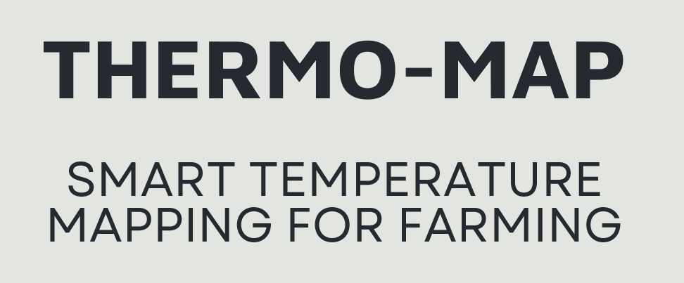
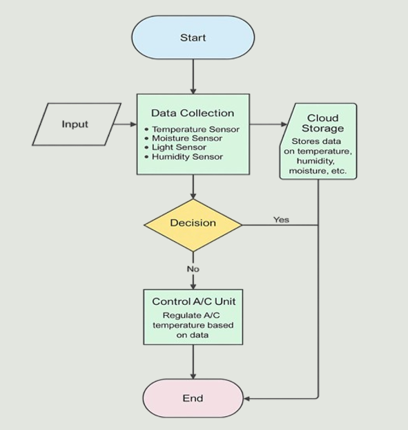

# 🌡️ **Thermo-Map: Smart Temperature Mapping for Mushroom Farming**

<!-- ADD PROJECT BANNER IMAGE HERE -->

---

## 📌 Overview

**Thermo-Map** is an IoT and ML-based smart temperature mapping system designed to optimize mushroom farming conditions. The project integrates multiple sensors with an ESP32 microcontroller to monitor real-time environmental data, predict temperatures at unmeasured locations, and generate a dynamic temperature heatmap for better climate control and decision-making.

---

## 🎯 Abstract

Optimal temperature is critical for mushroom yield and quality. Traditional manual monitoring is inefficient and inconsistent. Thermo-Map collects real-time temperature data using IoT sensors, processes it using Machine Learning techniques, and visualizes it through dynamic temperature mapping. This reduces manual effort, improves environmental stability, and supports data-driven farming.

---

## 🔧 Problem Statement

- Uneven temperature distribution in cultivation areas  
- Limited sensor coverage leading to incomplete data  
- Inefficient manual monitoring  
- Lack of real-time insights and delayed response to temperature changes  
- Negative impact on mushroom yield and quality  

---

## 🚀 Objectives

- Develop an automated temperature monitoring system  
- Deploy multiple sensors across the cultivation area  
- Use ML models to predict temperatures at unmeasured points  
- Generate real-time temperature heatmaps  
- Reduce manual labor and improve decision-making  
- Enhance mushroom yield and consistency  

---

## 🛠️ Hardware Components

<!-- ADD HARDWARE SETUP IMAGE HERE -->

- **ESP32 Microcontroller** – Data acquisition and Wi-Fi communication  
- **DHT11 Sensors** – Temperature and humidity sensing  
- *(Optional)* Moisture & light sensors for extended monitoring  

---

## 💻 Software Components

- **Machine Learning Model** – Regression / Kriging for temperature prediction  
- **Data Visualization** – Real-time heatmaps and dashboards  
- **Cloud Platform** – Data storage and remote monitoring  
- **Control Logic** – Automated alerts / AC control based on thresholds  

---

## 🔄 Methodology

<!-- ADD SYSTEM WORKFLOW DIAGRAM HERE -->

1. Deploy multiple DHT11 sensors across the farm  
2. Collect real-time data via ESP32  
3. Preprocess sensor data  
4. Apply ML model for temperature prediction  
5. Generate temperature heatmap  
6. Visualize results on a dashboard  
7. Trigger alerts / automated control if needed  
8. Store data in cloud for analysis  

---

## 📊 Results

- Accurate prediction of temperature at unmonitored locations  
- Real-time temperature heatmaps for identifying critical zones  
- Improved mushroom yield and consistency  
- Reduced manual monitoring effort  

---

## 🧠 Future Scope

- Integration of predictive climate control  
- Addition of humidity, CO₂, and air quality monitoring  
- Mobile application for remote monitoring  
- AI-based automated environmental control  

---

## 👥 Team Members

- **Tanish Parashar**  
- **Vishnu Hansda**  
- **Ananya Hota**  
- **Swastik Kumar Mohanty**  
- **Niranjan Kumar**  

**Guide:** Dr. Ambarish G. Mohapatra

---

## 📚 References

- Li, M., Wang, X., & Wu, Q. (2020). *Application of IoT and Wireless Sensor Networks in Precision Agriculture.* IEEE Access.  
- Ahmed, S., & Kim, D. (2019). *Kriging-based Spatial Interpolation for Smart Agriculture.* Sensors.  
- Espressif Systems. (2022). *ESP32 Technical Reference Manual.*  

---

## 📷 Image Placeholders (Add Your Images Here)

### 1. Lab Setup

### 2. Sensor Deployment

### 3. ESP32 Wiring

### 4. Temperature Heatmap

### 5. Cloud Dashboard

---

⭐ *If you like this project, consider starring the repository!*
